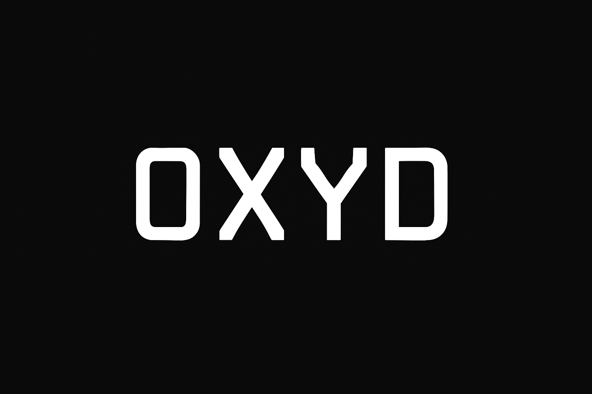
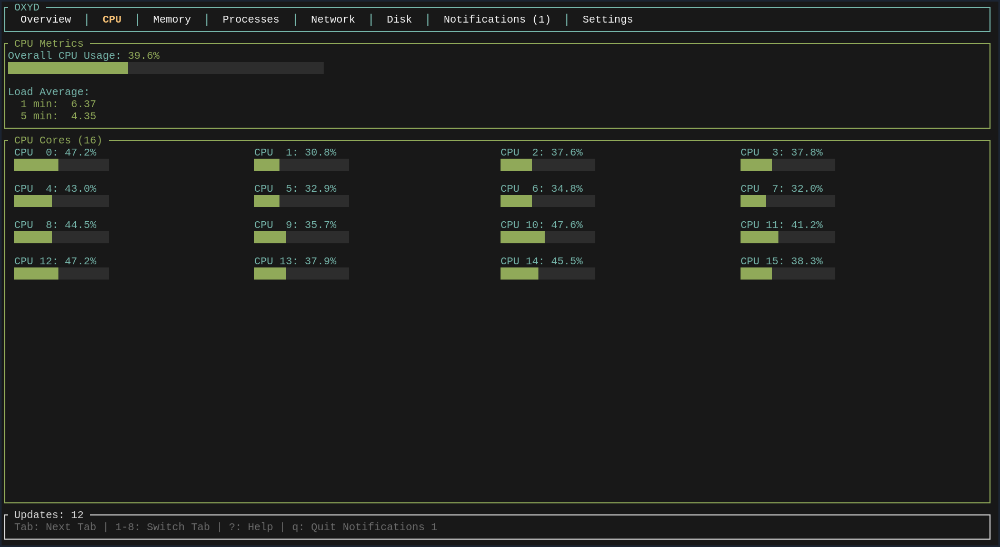

<h1 align="center"> OXYD </h1>
<p align="center">
  <a href="https://github.com/duolok/oxyd/actions/workflows/rust.yml">
    
  </a>
</p>

Oxyd is a System and Process monitoring tool written with Rust.

### Prerequisites

Before you get started with Oxyd, make sure you have the following prerequisites installed on your system:

- Rust (Cargo)
- Git
- Optional: Just

Note: Currently only Linux is supported.

### Installation

Clone the Oxyd repository and navigate into the directory:

```shell
cargo build --release
cargo run --release
```

### Gallery

Some screnshots from my terminal, colors might look different for you based on your terminal configuration.





### Keyboard Shortucts

| Key | Action |
|-----|--------|
| `1-8` | Switch between tabs |
| `Tab` / `Shift+Tab` | Next/Previous tab |
| `↑` / `↓` or `j` / `k` | Navigate lists |
| `PgUp` / `PgDn` | Page up/down |
| `/` | Search processes |
| `K` | Kill selected process (SIGKILL) |
| `t` | Terminate process (SIGTERM) |
| `s` | Suspend process (SIGSTOP) |
| `c` | Continue process (SIGCONT) |
| `r` | Refresh process list |
| `?` | Show help |
| `q` / `Esc` | Quit |


### Tabs

- **Overview** - System summary with graphs
- **CPU** - Detailed CPU metrics and per-core usage
- **Memory** - RAM and Swap usage
- **Processes** - Process list with sorting and filtering
- **Network** - Network interfaces and statistics
- **Disk** - Disk usage and I/O stats
- **Notifications** - Alert history
- **Settings** - Configure alert thresholds

### Architecture
Initial architecture of the project:

```
oxyd/
├── oxyd-core/            # Core engine and orchestration
├── oxyd-collectors/      # System metrics collectors
├── oxyd-domain/          # Domain models and traits
├── oxyd-process-manager/ # Process management implementation
└── oxyd-tui/             # Terminal user interface
```


###  Collectors
Summary of currenlty supported collectors

- CpuCollector - Reads from /proc/stat
- MemoryCollector - Reads from /proc/meminfo
- DiskCollector - Uses df for disk usage
- NetworkCollector - Reads from /proc/net/dev
- ProcessCollector - Aggregates process metrics

### Libraries

Oxyd is built with:
- tokio - Asynchronous runtime
- ratatui - TUI framework
- crossterm - Terminal manipulation
- serde - Serialization framework


